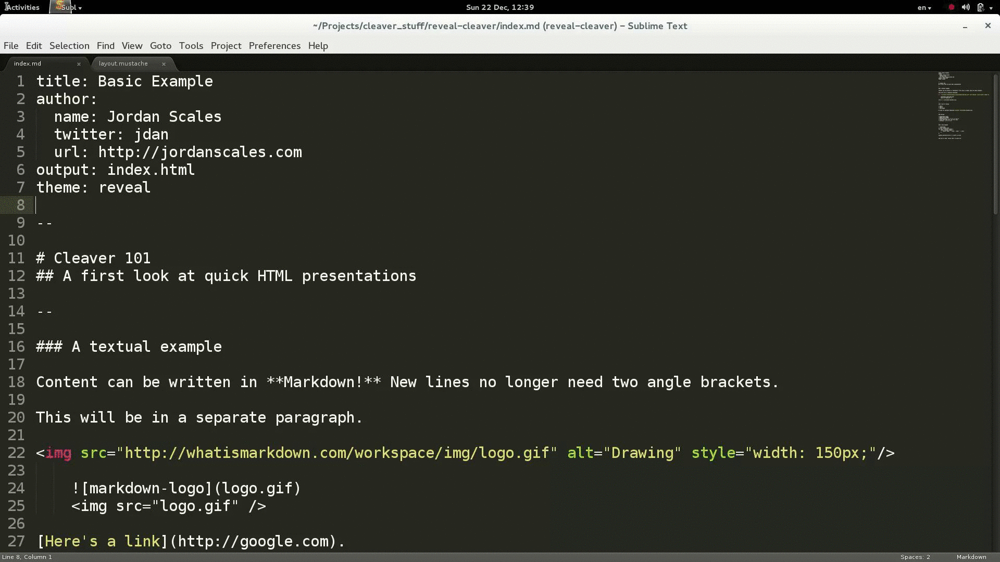

cleaver-template
================

[Reveal.js](https://github.com/hakimel/reveal.js/) theme for [cleaver](https://github.com/jdan/cleaver).

Small demo (sorry for image quality, will work on it) using [cleaver-template](https://github.com/sudodoki/cleaver-template)

How to run this?
================
Steps:  
1.   `git clone https://github.com/sudodoki/cleaver-template.git` into your presentation folder
2. Copy reveal/reveal into your presentation folder (will work on this one, stay cool)
3. Set `theme: reveal` in your metadata.

Have any question/proposals?
============================

Don't hesitate to open issue, or just to do regular fork-feature branch-pull request thing on me.